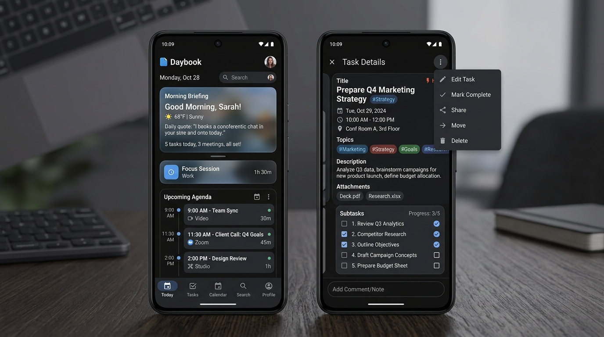

# Daybook

[](https://kotlinlang.org)
[](https://developer.android.com/studio/releases/gradle-plugin)
[](https://developer.android.com/jetpack/compose)
[](https://developer.android.com/about/dashboards)
[](https://developer.android.com/about/versions/16)
[](LICENSE)
[]()

> **100% Offline-First Personal Productivity & On-Device Intelligence for Android.**  
> A private, zero-cloud personal workspace built with **Jetpack Compose**, **Material 3**, **SQLCipher**, and on-device machine intelligence.

---


*Figure 1: Daybook Today dashboard with liquid frosted glass cards and morning briefing (left); read-only Task Details presentation sheet with overflow action menu (right).*

---

## Table of Contents

- [Vision & Architectural Invariant](#vision--architectural-invariant)
- [Key Features](#key-features)
  - [Today Dashboard & Liquid Glass UI](#today-dashboard--liquid-glass-ui)
  - [Read-Only Presentation Sheets & Overflow Actions](#read-only-presentation-sheets--overflow-actions)
  - [Task & Meeting Management with CadenceEngine](#task--meeting-management-with-cadenceengine)
  - [Work Journal / Daily Log](#work-journal--daily-log)
  - [Digital Wallet, Passes & OCR Document Upload](#digital-wallet-passes--ocr-document-upload)
  - [In-App Morning Briefing & Audio TTS](#in-app-morning-briefing--audio-tts)
  - [Natural Language Parser & Conversational Intelligence](#natural-language-parser--conversational-intelligence)
  - [Alarms, Mobile Notifications & Reboot Resilience](#alarms-mobile-notifications--reboot-resilience)
  - [WhatsApp Notification Reader & Android 13+ Setup](#whatsapp-notification-reader--android-13-setup)
  - [Battery Life & Network Radio Optimization](#battery-life--network-radio-optimization)
  - [Encrypted Backup & Storage Access Framework (SAF)](#encrypted-backup--storage-access-framework-saf)
- [Architecture & Tech Stack](#architecture--tech-stack)
- [App-Scoped Storage & Directory Architecture](#app-scoped-storage--directory-architecture)
- [Getting Started & Build Instructions](#getting-started--build-instructions)
- [Verification & Automated Test Suite](#verification--automated-test-suite)
- [Contributing Guidelines](#contributing-guidelines)
  - [Branching Model](#branching-model)
  - [Pull Request Workflow](#pull-request-workflow)
  - [Code Standards & Invariants](#code-standards--invariants)
  - [Commit Message Conventions](#commit-message-conventions)
- [License & Model Attribution](#license--model-attribution)

---

## Vision & Architectural Invariant

Daybook is engineered around a core, non-negotiable principle:

> **The application must be 100% functional with zero network connectivity and zero AI features active.**

All AI capabilities (Gemma 3 270M IT via LiteRT-LM, vector embeddings via ONNX, and optional cloud integrations) are **strictly opt-in**. The deterministic rule engine (`NaturalLanguageParser`, `BriefingWriter`, `CadenceEngine`, and `AgentEngine`) executes locally with zero network requests and zero battery-draining background loops.

All personal information—tasks, confidential notes, client meetings, health cards, driver's licenses, and chat messages—is stored in a **hardware-encrypted SQLCipher database** with encryption keys guarded by the **Android Keystore**.

---

## Key Features

### Today Dashboard & Liquid Glass UI
- **Liquid Frosted Glass (`GlassCard`):** Leverages Android 12+ (API 31+) hardware GPU shader blur (`RenderEffect.createBlurEffect`) with high-density multi-stop acrylic gradient fallbacks on API 26–30.
- **Physical Specular Rims:** Static linear gradient refraction borders replace continuous animation loops, eliminating battery drain and maintaining a steady 60–120 FPS.
- **Spring Touch Physics:** Interactive cards scale dynamically to `0.97f` on touch press using damped spring physics (`Spring.DampingRatioMediumBouncy`, `Spring.StiffnessLow`).
- **Tabular Figures (`tnum`):** Typography configured with font feature settings (`tnum`) across all counters, badges, and times to eliminate digit-jumping jitter.
- **Completed Today Shelf:** Collapsible shelf with spring-animated rotating chevron allowing instant review and single-tap undo for accidental completions.
- **4-Tab Navigation & Unified Pill FAB:** Material 3 compliant 4-tab bottom navigation (`Today`, `Tasks`, `Meetings`, `Log`) with a single expandable contextual action pill FAB.

### Read-Only Presentation Sheets & Overflow Actions
- **Dedicated Presentation Viewers:** Tapping a task, meeting, email, or WhatsApp message opens a read-only presentation sheet (`TaskCardSheet`, `MeetingCardSheet`, `GmailCardSheet`, `WhatsAppCardSheet`) displaying formatted description, date, time, location, composite topics, subtopics, and origin notes.
- **Three-Dot Action Menu:** Prevents accidental modification by separating viewing from editing. Users access "Edit" and "Delete" actions through an explicit three-dot overflow menu.
- **Auto-Expiring Suggestions:** Processed email suggestions auto-expire once associated tasks are completed, scheduled meeting days have passed, or 24 hours have elapsed. Past-dated unactioned emails are filtered out automatically.

### Task & Meeting Management with CadenceEngine
- **Prioritized Tasks:** Status tracking (`OPEN`, `IN_PROGRESS`, `DONE`, `CANCELLED`), priority levels (`LOW`, `MEDIUM`, `HIGH`, `URGENT`), and project tags.
- **CadenceEngine Auto-Spawning:** Deterministic recurrence calculations (`DAILY`, `WEEKDAYS`, `WEEKLY`, `MONTHLY`). Marking a recurring task done automatically calculates the next due date, clears calendar sync IDs, registers a new database occurrence, and schedules an advance reminder alert.
- **Meeting Tracker:** Tracks date, time, attendees, preparation notes, and action items.

### Work Journal / Daily Log
- Reverse-chronological timeline of daily reflections, accomplishments, decisions, and blockers.
- Categorized into structured entry types: `NOTE`, `WIN`, `BLOCKER`, and `DECISION`.

### Digital Wallet, Passes & OCR Document Upload
- **CameraX Barcode Scanner:** Real-time scanning for 1D and 2D barcodes (QR, PDF417, Aztec, Code 128, EAN, etc.).
- **ML Kit OCR Document Upload:** When selecting an image or document from the device gallery that lacks a barcode, ML Kit Text Recognition automatically extracts text and creates a searchable `DOCUMENT` card.
- **Persistent Favorites & Archives:** Favorites (`is_favorited`) and archives (`is_archived`) are persisted directly to SQLite, surviving device reboots and configuration changes.

### In-App Morning Briefing & Audio TTS
- **On-Demand Synthesis:** `BriefingWriter` computes an agenda summary combining overdue tasks, today's schedule, meetings, and follow-ups.
- **`BriefingSheet` Bottom Sheet:** Interactive bottom sheet on the Today dashboard providing the briefing text and spoken audio narration using Android's native `TextToSpeech` engine.
- **Scheduled 7:30 AM Notification:** Optional morning briefing notification via `BriefingNotificationWorker`.

### Natural Language Parser & Conversational Intelligence
- **3-Stage Compound Clause Splitter:** `NaturalLanguageParser.splitClauses()` decomposes compound sentences (e.g., *"two meetings tomorrow with Acme and three tasks for day after tomorrow"*) into individual discrete actions offline.
- **Schedule Query Handling (`QUERY_SCHEDULE`):** Questions such as *"what do I have to do today?"*, *"what is my schedule?"*, or *"do you want to tell me something that I have to do today?"* are recognized and answered directly with a structured summary of overdue items, today's tasks, meetings, and completed tallies.
- **Conversational Intelligence:** Conversational queries and greetings (`"hi how are you"`) are classified as `ParsedIntent.CONVERSATION` with helpful responses, eliminating awkward fallback task prompts.
- **Gemma 3 270M IT via LiteRT-LM:** Supports on-device inference using Google DeepMind's Gemma 3 270M IT model. Gated model downloads are authenticated with user-provided Hugging Face Bearer tokens with presigned AWS S3 redirect handling and SHA-256 verification.
- **Open Knowledge Format (OKF) Knowledge Graph:** `KnowledgeGraphEngine` maintains entity-relationship subgraphs (`kg_nodes`, `kg_edges`) and injects contextual triples into prompt contexts.
- **Offline BERT WordPiece Tokenizer:** Mathematically valid WordPiece tokenizer for MiniLM-L6-v2 embeddings with greedy subword prefix search and unicode accent normalization.
- **Resilient KNN Vector Search:** Pure Kotlin KNN cosine similarity fallback over SQLite float BLOBs in `embeddings_fallback`, ensuring search never fails even if native extensions are disabled by the OS.

### Alarms, Mobile Notifications & Reboot Resilience
- **`ReminderNotificationManager`:** Schedules high-priority reminder alerts using Android `AlarmManager`:
  - Meetings: **15 minutes in advance**.
  - Tasks: **9:00 AM on the due date**.
  - Overdue Fallbacks: Immediate notification scheduling (`now + 15m`) for same-day overdue tasks.
- **Runtime Notification Permissions:** Requests `POST_NOTIFICATIONS` at runtime on Android 13+ (API 33+) and configures high-importance notification channels (`IMPORTANCE_HIGH`) with lockscreen visibility.
- **Reboot Resilience (`BootReceiver`):** Listens for `ACTION_BOOT_COMPLETED` and vendor fast-boot intents (`QUICKBOOT_POWERON`) to automatically reschedule all pending alarms after device restarts.
- **Smart Alarm Cancellation:** Alarms automatically cancel when a task is completed or deleted and reschedule if reopened.

### WhatsApp Notification Reader & Android 13+ Setup
- Privileged `NotificationListenerService` (`WhatsAppListenerService`) with `android:exported="true"` reading incoming notification text locally.
- **Android 13+ Restricted Settings Flow:** Guides users step-by-step through Special App Access to enable notification listening on sideloaded APKs.
- Automatically extracts actionable tasks and meetings from incoming messages with quick-action suggestion chips (`"+ Add Task"`, `"+ Add Meeting"`).

### Battery Life & Network Radio Optimization
- **Passive Network Monitoring:** `NetworkTracker` uses passive system callbacks (`registerDefaultNetworkCallback`) instead of active requests, preventing mobile modem radios from being locked in high-power states.
- **Periodic Background Sync via WorkManager:** Optional Gmail sync runs on a 15-to-30 minute periodic schedule with strict constraints (`requiresBatteryNotLow` and `CONNECTED`), performing quick diffs, logging changes, and closing sockets immediately (`conn.disconnect()`).

### Encrypted Backup & Storage Access Framework (SAF)
- **`LocalBackupManager`:** Hardware-grade AES-256-GCM authenticated encryption with 128-bit authentication tags.
- Direct integration with Android's Storage Access Framework (`ACTION_CREATE_DOCUMENT` / `ACTION_OPEN_DOCUMENT`) allowing exports to user-selected cloud or local folders.
- Automatic rollback and staging to prevent database corruption during import.
- **Rolling File Logger (`DaybookLogger`):** Rolling on-device logging (`daybook-app.log`) with 1 MB rotation and automatic credential redaction (Hugging Face tokens, Bearer headers, passphrases, passport numbers).

---

## Architecture & Tech Stack

```
app/src/main/java/com/sr2ma/daybook/
├── ai/             # LiteRT-LM engine, ONNX embedding, WordPiece tokenizer, ModelDownloader, VectorStore
├── data/           # DaybookDatabase (SQLCipher), DatabaseKeyManager (Keystore), DAOs, DaybookRepository
├── domain/         # NaturalLanguageParser, TodayBuilder, BriefingWriter, CadenceEngine, AgentEngine, KnowledgeGraphEngine
├── logging/        # DaybookLogger (1 MB rolling log with privacy redaction)
├── notifications/  # ReminderNotificationManager, ReminderReceiver, BootReceiver
├── sync/           # LocalBackupManager (SAF), GmailSyncEngine, GmailSyncWorker, DriveBackupWorker, CalendarSyncWorker
├── ui/             # DaybookApp, DaybookViewModel, theme, Glassmorphism, screens, presentation sheets
└── whatsapp/       # WhatsAppListenerService, WhatsAppSettingsSection, WhatsAppReplyHelper
```

| Layer | Technology | Details |
| :--- | :--- | :--- |
| **Language** | Kotlin 2.2.20 | Modern, idiomatic coroutines & StateFlow |
| **UI Framework** | Jetpack Compose (BOM 2025.09.00) | Declarative UI, Material 3, Custom Glassmorphic design system |
| **Database & Security** | SQLCipher 4.5.6 | 256-bit AES database encryption, Android Keystore StrongBox key storage |
| **On-Device LLM** | Gemma 3 270M IT via LiteRT-LM | INT8 QAT, ~250–300 MB post-install download (never bundled in APK) |
| **Embeddings & Search** | ONNX MiniLM-L6-v2 + WordPiece | 384-dimensional embeddings, KNN cosine distance fallback |
| **Vision & Scanning** | Google ML Kit (Bundled) | `barcode-scanning:17.3.0`, `text-recognition:16.0.1` (100% offline) |
| **Camera** | CameraX 1.4.1 | Custom preview and frame analysis pipeline |
| **Background Work** | Android WorkManager 2.10.0 | Periodic sync with battery constraints, daily briefing notifications |
| **Target SDK** | SDK 36 (Android 16) | Min SDK 26 (Android 8.0 Oreo) |

---

## App-Scoped Storage & Directory Architecture

All application data is isolated inside private app-scoped internal storage (`context.filesDir` and `context.getDatabasePath()`):

| Path | Description | Encryption / Format |
| :--- | :--- | :--- |
| `context.getDatabasePath("daybook.db")` | Core SQLite database storing tasks, meetings, logs, passes, chats, knowledge graph, and vector embeddings. | SQLCipher 256-bit AES encrypted |
| `context.getDatabasePath("daybook.db-wal")` | SQLite Write-Ahead Log journal. | Ephemeral database journal |
| `context.filesDir/daybook_db_passphrase.enc` | 256-bit database encryption passphrase. | Android Keystore AES-256-GCM |
| `context.filesDir/logs/daybook-app.log` | Active rolling execution log (auto-sanitized, no secrets). | Plaintext rolling log |
| `context.filesDir/logs/daybook-app.log.1` | Rotated execution log (created when active log exceeds 1 MB). | Plaintext rolling log |
| `context.filesDir/gemma-270m-it-q8-v1.litertlm` | On-device Gemma 3 270M IT model weights. | LiteRT-LM binary format |
| `context.filesDir/daybook_restore.tmp` | Atomic temporary staging file used during database restoration. | Ephemeral staging file |

---

## Getting Started & Build Instructions

### Prerequisites
- JDK 17 or higher
- Android SDK (API 36, Build Tools 36.0.0)

### 1. Build via Command Line
```bash
# Clone the repository
git clone https://github.com/fncreator22/Daybook-app.git
cd Daybook-app

# Windows
gradlew.bat assembleDebug

# macOS / Linux
./gradlew assembleDebug
```
The output APK will be generated at:
`app/build/outputs/apk/debug/app-debug.apk`

### 2. Run Automated Unit Tests
```bash
# Windows
gradlew.bat testDebugUnitTest

# macOS / Linux
./gradlew testDebugUnitTest
```

### 3. Install on a Connected Device
```bash
adb install -r app/build/outputs/apk/debug/app-debug.apk
```

---

## Verification & Automated Test Suite

Daybook maintains a strict test-driven development (TDD) discipline. Every domain rule, parser case, alarm receiver, database codec, and sync engine feature is covered by unit tests:

- **182 Unit Tests across 19 Test Suites (100% Pass Rate)**
- Test Suites include:
  - `NaturalLanguageParserTest`: Compound clause splitting, relative date resolution, time parsing, schedule query detection, and conversational intent detection.
  - `GmailSyncEngineTest`: Topic extraction, composite tag preservation, location normalization, date parsing, and task note construction.
  - `TodayBuilderTest`: Bucket aggregation, timezone boundary handling, and active vs. archived pass segregation.
  - `CadenceEngineTest`: Recurrence scheduling, calendar ID clearance, and next occurrence calculation.
  - `BootReceiverTest`: Boot action filtering and pending alarm recalculation.
  - `DatabaseKeyManagerTest`: Key generation, test isolation, and SQLite header validation.
  - `VectorStoreTest`: Vector serialization, deserialization, and cosine distance math.
  - `WordPieceTokenizerTest`: Basic tokenization, greedy subword matching, and accent normalization.
  - `LocalBackupManagerTest`: AES-256-GCM export, restore, tampered ciphertext rejection, and magic header validation.
  - `DaybookLoggerTest`: Log persistence, 1 MB file rotation, and credential sanitization.

---

## Contributing Guidelines

We welcome contributions from the community. To ensure code quality, stability, and offline security, please adhere to our contribution standards.

### Branching Model

Daybook employs a dual-tier branching strategy:

1. **`main` Branch (Production Protected):**
   - Contains stable, release-ready code.
   - **Direct pushes to `main` are strictly prohibited for all non-admin contributors.**
   - Only repository owners and designated administrators hold permissions to merge Pull Requests into `main`.
2. **`test` Branch (Staging & Integration):**
   - The primary staging branch for active development.
   - **All external Pull Requests must target the `test` branch.**
   - Once changes pass continuous integration and manual verification on `test`, the repository admin merges `test` into `main`.
3. **Working Branches (`feat/*`, `fix/*`, `docs/*`, `refactor/*`):**
   - Contributors branch off `test` to implement their changes.

### Pull Request Workflow

Follow these steps to submit a contribution:

#### Step 1: Clone and Checkout Staging
```bash
git clone https://github.com/fncreator22/Daybook-app.git
cd Daybook-app
git checkout test
git pull origin test
```

#### Step 2: Create a Dedicated Feature or Fix Branch
```bash
# Examples: feat/widget-support, fix/calendar-timezone, docs/architecture-diagram
git checkout -b feat/your-feature-name
```

#### Step 3: Implement Changes & Adhere to Standards
- Keep your changes focused on a single responsibility.
- Write or update unit tests in `app/src/test/java/com/sr2ma/daybook/` to cover new logic.
- Ensure the 100% offline-first invariant is strictly preserved.

#### Step 4: Run Automated Verification Locally
All automated checks must pass before pushing:
```bash
# Windows
gradlew.bat testDebugUnitTest
gradlew.bat assembleDebug

# macOS / Linux
./gradlew testDebugUnitTest
./gradlew assembleDebug
```

#### Step 5: Commit with Conventional Commits
```bash
git add .
git commit -m "feat: implement interactive widget for Today agenda"
```

#### Step 6: Push to Your Remote Branch
```bash
git push origin feat/your-feature-name
```

#### Step 7: Open a Pull Request Targeting `test`
- Navigate to GitHub and open a Pull Request.
- **Ensure the base branch is set to `test`** (do NOT select `main`).
- Provide a clear description of the problem solved, testing steps executed, and any relevant issue references.

#### Step 8: Code Review & Admin Merge
- Maintainers review the PR against coding standards and architectural invariants.
- Upon approval, a repository admin merges the PR into `test`.
- Once verified on the staging build, the admin performs the final release merge from `test` into `main`.

### Code Standards & Invariants

- **Offline-First Non-Negotiable:** Core features (tasks, meetings, logs, wallet, alarms, briefing, natural language parsing) must never require internet access. No background network calls may be added to core workflows.
- **SQLCipher Data Security:** Personal information, credentials, and passes must never be stored in plaintext. Always use the encrypted DAO layer.
- **Battery & Modem Conservation:** Never register continuous active network requests. Use passive system callbacks or battery-constrained WorkManager jobs for optional sync.
- **Clean Architecture & MVVM:** Maintain clean separation between `ui`, `domain`, `data`, and `sync` layers. Business logic belongs in pure Kotlin domain engines, not in Compose UI elements.
- **No Emojis in Repository Documentation:** Repository technical documentation, Markdown files, and commit logs must maintain a professional tone without emojis.

### Commit Message Conventions

Commit messages must follow the [Conventional Commits](https://www.conventionalcommits.org/) specification:

- `feat:` A new user-facing feature.
- `fix:` A bug fix.
- `docs:` Documentation-only changes.
- `test:` Adding missing tests or correcting existing tests.
- `refactor:` Code change that neither fixes a bug nor adds a feature.
- `perf:` A code change that improves performance or battery consumption.

---

## License & Model Attribution

Daybook is licensed under the [Apache License, Version 2.0](LICENSE).

### Model & Component Attribution
- **Gemma 3 270M IT** by Google DeepMind is governed by the [Gemma Terms of Use](https://ai.google.dev/gemma/terms).
  Attribution: *"Gemma 270M by Google DeepMind — gemma.google.com/terms"*.
- **Google ML Kit** bundled text and barcode scanning models are governed by the Google APIs Terms of Service.
- **SQLCipher** is developed by Zetetic LLC and governed by the Zetetic Community License.
